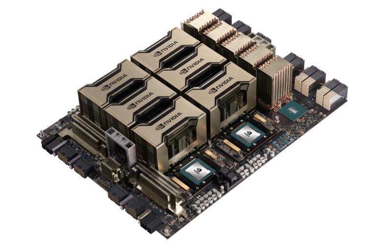

<!--

author:   Scott Feister

email:    scott.feister@csuci.edu

version:  0.0.1

language: en

narrator: US English Female

comment:  Scientific Visualization for COMP 566: Geometry and Computer Graphics
          COMP 566, Spring 2024.

-->

# Scientific Visualization Laboratory

## Pre-Work (A Week or More in Advance)
You will complete the following pre-work in advance of the lab day.


### Apply for a NERSC Account (15 minutes)

I have an award of supercomputing time granted to me from a [government-funded national supercomputer center](https://www.nersc.gov/). This center, called NERSC, is located in San Francisco. We will be accessing limited numbers of computing nodes on the [Perlmutter supercomputer](https://www.nersc.gov/systems/perlmutter/). You can [read about the architecture here](https://docs.nersc.gov/systems/perlmutter/architecture/).

Note from NERSC staff, before proceeding:

> Your account will undergo user vetting, in accordance with NERSC policies, to verify your identity. Under some circumstances, there could be a delay of up to a week while this vetting takes place.

NERSC representatives have assured me this user vetting is lighter than a typical background check, and importantly, does not involve investigation of immigration status. Please reach out to me directly if you'd like more details before proceeding, and I will find out more.


<section>

#### Step-by-Step: Apply for a NERSC Account
Here's how students enrolled in COMP 566 at CSUCI can sign up for an account at NERSC:

1. Navigate to [NERSC Add User](https://iris.nersc.gov/add-user)
2. Select "I need a new NERSC account"
3. Click ORCID n/a
4.  Pick a username that is your first initial + last name. (If that's taken, add a number at the end -- and if your name is too long, truncate this. Example: If your name is Jane Doe, choose "jdoe" or "jdoe5".)
5.  Search by PI Name, type "feister", and select m4347 (coa)
6.  Fill out your name and citizenship.
7.  For organization, type "California State University Channel Islands (CSUCI)"
8.  For Department, type "Computer Science"
9.  For Work role, select "GRAD STUDENT" (or equivalent)
10. For email, use your official CSUCI email.
11. For Work Phone, add your real phone number., e.g. your cell phone or home number.
12. For comments, note "I am an graduate student in Dr. Scott Feister's COMP 566 class at CSUCI."
13. Confirm you aren't a robot.
14. Click "Ok" to submit your form.

After you're done, there will be a security vetting step that may take a couple days. Then I'll approve you on my end, and then you're in.


</section>

## Pre-Work (After you've got an account)
Once you receive an email saying your account has been created, you can continue with this next pre-work.

### Activate Your NERSC Account (5 minutes)
Several days after your initial application for a NERSC account (prior pre-work), you will receive an email from NERSC saying that your account has been approved, and with instructions to activate your new account. Follow the link in your email to "reset your password" for your NERSC account. Actually, this is the first time you will choose your password, so pick a new password and write it down.

Choose a new password and write it down somewhere you'll remember. **Leave the "MFA" field blank** as you haven't set up MFA yet (you'll do that after setting your password.)

**Note: Make Sure to Write Down your NERSC Password**
After your first "reset" (actually just setting the password), all subsequent password reset processes take about an hour. So, if you do forget your first password, then reset your password a second time, wait an hour, then try logging in again.

### Enable Multi-Factor Authentication for Your NERSC Account (10 minutes)
The tools we will be using at NERSC requires you user account to have multi-factor authentication (MFA) enabled. In this section of pre-work, you'll enable and test multi-factor authentication. You'll need your mobile phone for this pre-work, as it involves installing an app.

<section>

#### Step-by-Step: Enable Multi-Factor Authentication (MFA)
You'll install an authenticator app on your phone, and use that app to get a unique "one-time password" (OTP), or "token", each time you login to NERSC. This token is in addition to your regular NERSC password.

1. Open a new browser tab and follow the [official NERSC instructions to set up MFA](https://docs.nersc.gov/connect/mfa/).
2. You probably already have an authenticator app on your phone. If you already have an authenticator app on your phone, such as **Google Authenticator**, **Authy**, **Duo Mobile**, or **Microsoft Authenticator**, you can skip directly to [Creating and Installing a Token](https://docs.nersc.gov/connect/mfa/#creating-and-installing-a-token).
3. When you get to the section titled "Testing Your New Token", save a screenshot showing that you've been successful.


</section>


<section>

#### Step-by-Step: Log into NERSC Jupyter Hub

1.  Navigate in a web browser to the [NERSC Jupyter Hub](https://jupyter.nersc.gov).
2.  When prompted, select "Sign in with Federated Identity at NERSC."
3.  At the federated login page, when prompted to "Choose your Institution", select "National Energy Research Scientific Computing Center (NERSC)."
4.  Enter your NERSC username and password. On the next page, enter your multi-factor authentication token (e.g. the six digits from your phone authentication app; no spaces).

#### Show Me: Successful Login
5.  Upon successful login, show your teacher the completed login screen, and then you can logout again.

</section>

### (At-Home) Introductory Videos (30 minutes)
In this pre-work, you will watch videos about NERSC and careers in High Performance Computing (HPC). You will then learn about the specifics of the NVIDIA GPU hardware we will use. These videos and readings will give you context for possible careers you may never have considered, and will also help you get the most value out of our lab work.

Once you've watched the videos and completed all readings, we will have a discussion in class.

#### Watch: What is High Performance Computing (HPC)?

High Performance Computing (HPC) facilities are developed and used in industry (Microsoft, Amazon, Google, NVIDIA, etc.) and scientific research teams / government (Department of Energy, Department of Defense, research universities like UCSD, etc.). This lab will be using HPC resources through a government resource called NERSC, located at Berkeley, CA.

Before we get into NERSC and supercomputers, what is HPC in general, and what are some uses? Watch the following video from industry (Microsoft) to find out!

!?[What is HPC? (by Microsoft)](https://www.youtube.com/watch?v=0biElmaDfFs)

#### Watch: NERSC, Supercomputers, and Scientific Computing

In this lab, you'll be logging into a supercomputer named "NERSC Perlmutter". This is a government-owned supercomputer funded through the Department of Energy. There are only a small handful of supercomputers like this around the country!

But what exactly is a supercomputer? Please watch a video introduction to supercomputers before class!

!?[What is a Supercomputer? (Lawrence Livermore National Laboratory)](https://www.youtube.com/watch?v=9M99STmu-vI)

#### Watch: Careers in HPC for Computer Scientists

Computer science degrees are valuable and lead to many careers in HPC. Choose **just one video** below to watch, which represent three examples of careers in HPC!

<section>

#### Video Option A: I/O Specialist
!?[Careers in HPC: I/O Specialist Elsa Gonsiorowski, Lawrence Livermore National Laboratory, USA](https://www.youtube.com/watch?v=UzlP0w-BWZo)

#### Video Option B: Web & Mobile Applications Manager
!?[Careers in HPC: Web & Mobile Applications Manager, Tracy Brown, TACC, USA](https://www.youtube.com/watch?v=wuXO2Mhnqm0)

#### Video Option C: Application Developer and Outreach
!?[Careers in HPC: Application Developer, HPC Education & Outreach, Weronika Filinger, EPCC, UK](https://www.youtube.com/watch?v=XAfyQjZNAmM)

</section>

#### (Optional) Dig deeper with these additional resources and videos:

You've now completed your pre-work!

The following resources are optional, only if you'd like to dig deeper. You can also come back to these later.

1. Visit the [NERSC YouTube page](https://www.youtube.com/@theRealNERSC) for a lot more videos specific to Perlmutter, the supercomputer you'll be using in class!
2. [Video: Go on a Tour of a Supercomputer! (University of Wisconsin-Eau Claire)](https://www.youtube.com/watch?v=uxYX8KXdC0g)
3. [Video: What is a Supercomputer? (Argonne National Laboratory)](https://www.youtube.com/watch?v=4xHoWwxdlms)
4. If you want to dive really deep and are considering exploring a career in HPC: here's a [three-hour crash course in supercomputing](https://www.youtube.com/watch?v=sVLhWWOxjdo&list=PL20S5EeApOSvQK4rPN53MR3EVWN10KULp) from the staff at NERSC. You can actually meet these people if you'd like! Just ask me for their contact information and I'll put you in touch.

### (Optional) Readings on GPUs and Massive Parallelism

#### Case Study: NVIDIA A100 GPUs
NERSC Perlmutter contains **7,208 NVIDIA A100 GPUs**.

You will each access one of these GPUs during next week's lab.

##### How are data center GPUs different from home computer GPUs?
The architects of Perlmutter deliberately chose to use the **NVIDIA A100** GPU, and not a gaming GPU like the **NVIDIA GTX 3080** GPU. This is because the A100 GPU is extremely powerful for scientific computation and its entire design is optimized for data centers (rather than for home computer graphics or video games). In fact, the NVIDIA A100 GPU does not have any video output port whatsoever! You literally could not plug your monitor into an NVIDIA A100 GPU.

Note that with each generation of GPUs from NVIDIA and other companies like AMD, there are different models built with different optimizations. Tradeoffs in the design of GPUs include everything we've discussed this semester with relation to tradeoffs in the design of CPUs - performance versus power consumption, specialization vs. generalization, read/write speeds vs. quantity of memory, number of caches and their locations, organization of processor cores, instructions available in the instruction set, pipelining, number of processors, etc. And just like with CPUs, the GPU in your phone will be designed quite differently than the GPU in a data center -- because the benefits of certain tradeoffs are different in these contexts.

##### Watch: YouTube Video by Engadget: NVIDIA's massive A100 GPU isn't for you (10 minutes)
!?[Engadget: NVIDIA's massive A100 GPU isn't for you](https://youtu.be/ig-7Hyd3Klw)

##### Massive Parallelism of the A100
The massive repetition of elements within each A100 GPU reflects the massive parallelism facilitated by this GPU. The diagrams below showcase this parallelism.

 on this GPU, leading to the repetitive grid appearance. The repetition of many identical elements is indicative of the massive parallelism of a GPU -- all these SMs can do computations in parallel with one another, as can the multiple processors within each SM. Note also that the A100 has two large memory caches - 'L2 Cache' to serve as shared memory between the SMs. The total L2 Cache size is 40 GB for the A100 GPUs you will use in this lab.")

 do computations in parallel with one another. In addition to the processing elements in parallel, note that we have many caches in parallel - in other words, many parallel memory structures.")

##### Time Penalties of Data Transfer to GPUs

There exists physical distance between the GPUs and the two CPUs (silver squares). Therefore, data has to be sent back and forth across the motherboard between the CPU and GPUs. Data transfer incurs a time penalty in your code each time it happens.



Learn More:

1. [Ampere Architecture](https://developer.nvidia.com/blog/nvidia-ampere-architecture-in-depth/)
2. [NVIDIA A100 PDF](https://images.nvidia.com/aem-dam/en-zz/Solutions/data-center/nvidia-ampere-architecture-whitepaper.pdf)
2. [Introducing NVIDIA HGXA100](https://developer.nvidia.com/blog/introducing-hgx-a100-most-powerful-accelerated-server-platform-for-ai-hpc/)


## (Pre-Work Activity) Remotely Access NERSC JupyterHub and Linux Terminal

You will log into the NERSC supercomputer and access one of its A100 GPUs for today's lab. You'll access the supercomputer through a portal they provide, called the "NERSC Jupyter Hub".

The following slides will walk you through getting connected in a step-by-step fashion. Please follow these instructions individually from start to finish.

### Log into NERSC Jupyter Hub

1.  Navigate in a web browser to the [NERSC Jupyter Hub](https://jupyter.nersc.gov).
2.  When prompted, select "Sign in with Federated Identity at NERSC."
3.  At the federated login page, when prompted to "Choose your Institution", select "National Energy Research Scientific Computing Center (NERSC)."
4.  Enter your NERSC username and password. On the next page, enter your multi-factor authentication token (e.g. the six digits from your phone authentication app; no spaces).

### Start a "Shared GPU" Job
5. From the Jupyter Hub Perlmutter landing page, under **"Shared GPU Node"**, press **"Start"**.
6. After a short wait, you will arrive at a page that includes a "Launcher" tab. Keep this tab open for later.

If you can't get a Shared GPU Job started due to a timeout, try again. If still no luck, you can just use a login node. This won't give you a dedicated A100, but you still will have the capability to run your code on the GPU.

### Launch "Terminal"
7. From the "Launcher", scroll down all the way to the "Other" section, and select "Terminal". This will open a Linux terminal window, logged into Perlmutter.

### Transition to Basics of Terminal

Congratulations! You have now launched a Linux Terminal that's running on a supercomputer in San Francisco. Anything you type into this terminal window is run on a single node of the NERSC Perlmutter supercomputer. You may now move forward into the next section, where you will pick up the smallest number of basics of the Linux Terminal that you'll need to complete the rest of today's activities.

## (Pre-Work Activity) Linux Terminal Basics

When we remotely access a computer, it's typical to interact with it using a Linux terminal. Keep the following resources handy throughout the lab period, by opening each in a new tab. I picked these resources out specifically for their simplicity and beginner-friendly approach.

1. [Some basic Linux commands which we can use in the terminal](http://www.cs.umd.edu/~nelson/classes/resources/BasicLinux.shtml) for this lab period. Open it in a new tab and keep it handy!
2. [Compiling C Programs with GCC](https://www.wikihow.com/Compile-a-C-Program-Using-the-GNU-Compiler-(GCC))

Note that another compiler, "nvcc", is invoked in a similar way to "gcc". Use "gcc" to compile pure C code, and use "nvcc" to compile GPU code for NVIDIA GPUs.

Now that you have your basics of the Linux terminal ready, you'll start by running a "Hello, World" on a CPU, then you'll move your "Hello, World" program to a GPU.

## (Pre-Work Activity) Run "Hello, World" on a Perlmutter CPU

You may need teacher help to follow along with these steps. I will lead you through this section as a class.

<section>

#### Create a project folder

1. In the left-hand panel of JupyterHub, move your cursor under the header of "File Browser".
2. Right click anywhere within the File Browser section to open a drop-down menu with options for creating elements. In that menu, select "New folder".
3. Name your folder something like "COMP566".
4. Navigate into your newly-created folder by double-clicking it.

#### Create a new file named "hello.c" in your project folder

5. Now that you've navigated into your new folder, right click again anywhere within the File Browser section to open the same drop-down menu. This time, in that menu, select "New File".
6. Name your new file "hello.c". (Note, you'll need to delete the ".txt" extension -- in other words, name your file "hello.c", not "hello.c.txt").

#### Write C code your "hello.c" file using the File Browser's text editor

7. Finally, within the File Browser, double click on your newly-created "hello.c" file to open and edit it within a new text editing tab of Jupyter Hub.
8. Paste the following contents into your file, edit it to change "Hello, world" to something more fun like "Hello, Scott!", and save your new file.

```c
#include <stdio.h>

void c_hello(){
    printf("Hello World!\n");
}

int main() {
    c_hello();
    return 0;
}
```

#### Open a Linux Terminal on NERSC and navigate to your project folder

9. From JupyterHub, launch a new Terminal tab. That is, create a new Launcher tab, then scroll down and select "Terminal". This will give you access to a private Linux Terminal, from your web browser, running on one of the login servers (login nodes) of the NERSC Perlmutter supercomputer.
10. You start in the Linux Terminal in your "Home" folder, which is represented by a tilde (~). From the Linux Terminal, navigate to your project folder.
11. You'll use the `ls` command you learned earlier to see what's in the current folder. Try it out now.
12. You'll see the `cd` command to navigate into your project folder. For example, if using `ls` you see your project folder called "COMP566", then navigate into that folder by typing `cd COMP566`.
13. Confirm you are in your project folder by examining the path to left of your cursor. It should now show `~/COMP566`.
14. Confirm that your file, "hello.c" is in your project folder, by typing `ls`. You should see "hello.c" listed.
15. Confirm the contents of your file are as you desired, by typing `cat hello.c`, which will display the contents of your file within the Linux Terminal.

#### Compile and run your "hello.c" program from the Linux Terminal on NERSC

16. Compile your "hello.c" file from the terminal using gcc. To do this, type `gcc hello.c -o hello.o`. This syntax will compile hello.c into an executable file named "hello.o".
17. Confirm that you've created your executable, by typing `ls` to show folder contents. You should now see "hello.c" and "hello.o" both listed in your folder contents.
18. Run your "hello.o" executable, by typing `./hello.o`. You should see "Hello, World!" or equivalent printed out.

</section>